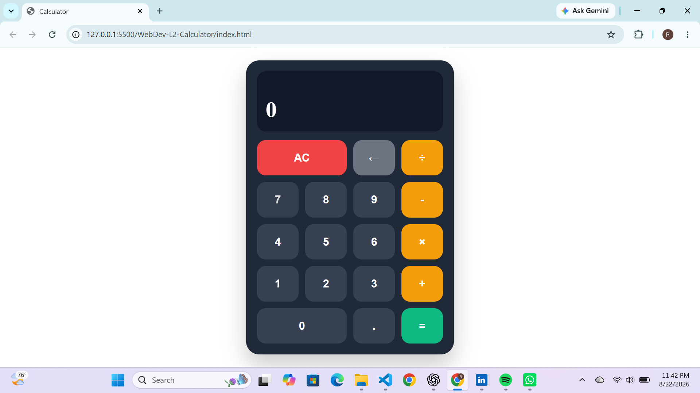

# Calculator

A responsive calculator built with HTML, CSS, and JavaScript as part of my OASIS INFOBYTE Web Development & Designing Internship.

## Features

- Basic arithmetic operations: addition, subtraction, multiplication, and division
- Decimal number calculations
- Clear and delete functions
- Error handling for division by zero
- Sequential calculations
- Previous calculation display
- Responsive design for different screen sizes

## Technologies Used

- HTML5
- CSS3
- JavaScript

## Screenshot

## How to Use

1. Open the calculator in your browser.
2. Enter numbers using the calculator buttons.
3. Select an arithmetic operator.
4. Enter the next number.
5. Press `=` to display the result.
6. Use `AC` to clear the calculator.
7. Use `←` to delete the last digit.

## Live Demo

[View Calculator](https://horlah-dev.github.io/OIBSIP/WebDev-L2-Calculator/)

## Author

Raji Ridwan
