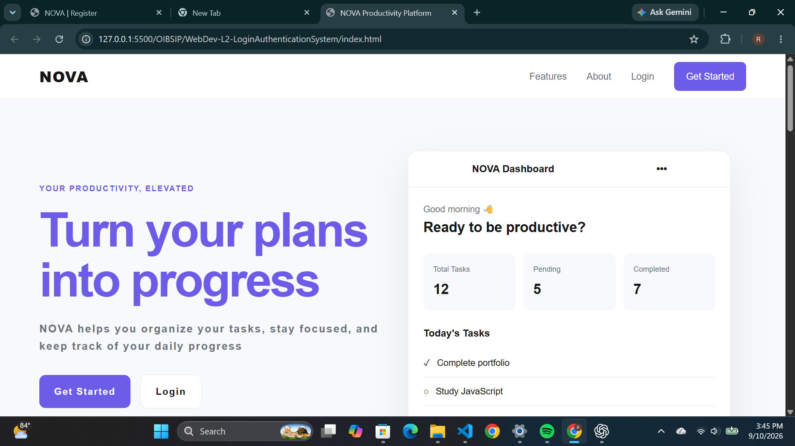

# **NOVA — Login Authentication System**

A responsive productivity platform built with HTML5, CSS3, and vanilla JavaScript. The application allows users to register, log in, reset their password, and manage their tasks through a simple productivity dashboard.

## **Features**

* User registration and account creation

* User login authentication

* Forgot password and password reset functionality

* Dashboard for managing tasks

* Add, complete, edit, and delete tasks

* Automatically move completed tasks to the Completed Tasks section

* Display pending and completed task counts

* Save user accounts and tasks using browser localStorage

* Responsive layout for desktop and mobile devices

## **Technologies Used**

* HTML5

* CSS3

* JavaScript (Vanilla)

* localStorage

## **Project Structure**

```text id="9x4m2k"
WebDev-L2-LoginAuthenticationSystem/

├── index.html

├── index.css

├── index.js

├── pages/

│   ├── login.html

│   ├── register.html

│   ├── forgot-password.html

│   └── dashboard.html

├── screenshots/

│   ├── landing.png

│   ├── register.png

│   ├── login.png

│   ├── forgot-password.png

│   └── dashboard.png

└── README.md
```

## **Live Demo**

[View NOVA Login Authentication System](https://horlah-dev.github.io/OIBSIP/WebDev-L2-LoginAuthenticationSystem/)

## **Screenshots**

### **Landing Page**




### **Register Page**

.png)

### **Login Page**

.png)

### **Forgot Password Page**

.png)

### **Dashboard**

.png)

## **OASIS INFOBYTE Internship**

This project was completed as part of the OASIS INFOBYTE Web Development & Designing Internship.

* Track: Web Development & Designing

* Level: Level 2

* Task: Task 4 — Login Authentication System

## **Author**

Raji Ridwan
