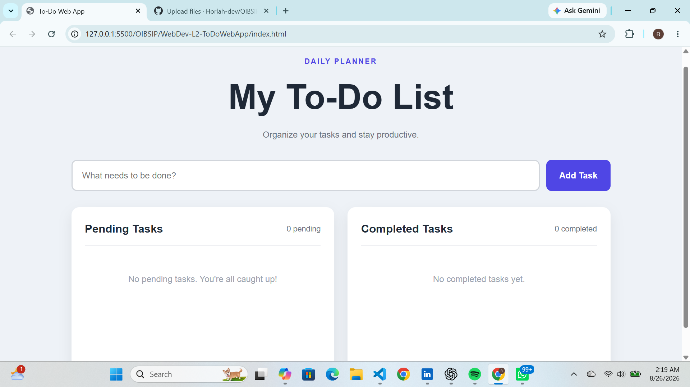

# To-Do Web App

A responsive task management application built with HTML5, CSS3, and vanilla JavaScript. The app allows users to create, complete, edit, and delete tasks while keeping pending and completed tasks organized.

## Features

* Add new tasks
* Display pending tasks
* Mark tasks as completed
* Automatically move completed tasks to the Completed Tasks section
* Edit task text
* Delete tasks
* Display pending and completed task counts
* Display task creation and completion timestamps
* Friendly empty-state messages
* Save tasks using browser localStorage
* Responsive layout for desktop and mobile devices

## Technologies Used

* HTML5
* CSS3
* JavaScript (Vanilla)
* localStorage

## Project Structure

```text
WebDev-L2-ToDoWebApp/
├── index.html
├── index.css
├── index.js
├── README.md
└── screenshot.png
```

## How It Works

Users can enter a task in the input field and click **Add Task**. New tasks appear under **Pending Tasks**.

Each pending task can be:

* Completed
* Edited
* Deleted

When a task is completed, it automatically moves to the **Completed Tasks** section. The application also records timestamps and stores tasks in localStorage so they remain available after refreshing the page.

## Live Demo

[View Live To-Do App](https://horlah-dev.github.io/OIBSIP/WebDev-L2-ToDoWebApp/)

## Screenshot



## OASIS INFOBYTE Internship

This project was completed as part of the OASIS INFOBYTE Web Development & Designing Internship.

* Track: Web Development & Designing
* Level: Level 2
* Task: Task 3 — To-Do Web App

## Author

Raji Ridwan 
