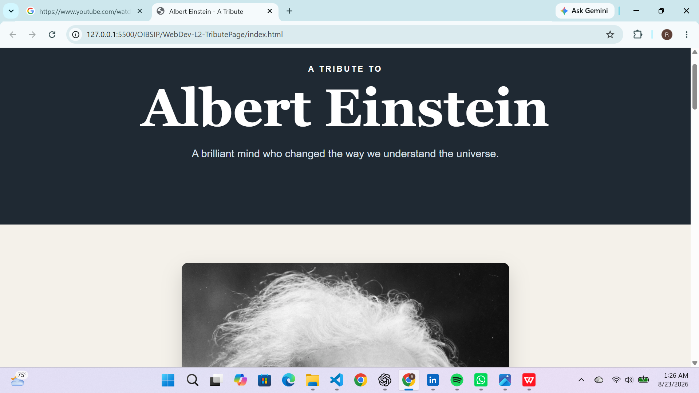

# Albert Einstein Tribute Page

A responsive tribute webpage dedicated to Albert Einstein, one of the most influential physicists of the 20th century.

## Features

* Hero section with Einstein's name and tagline
* Prominent portrait of Albert Einstein
* Biography section with four paragraphs
* Timeline of major life events and achievements
* Styled quote section
* Responsive layout for desktop and mobile devices
* Multiple background colors for visual separation
* Different typography styles for headings and body text

## Technologies Used

* HTML5
* CSS3

## Project Structure

```text
WebDev-L2-TributePage/
├── index.html
├── index.css
├── README.md
└── screenshot.png
```

## Live Demo

[View Tribute Page](https://horlah-dev.github.io/OIBSIP/WebDev-L2-TributePage/)

## Screenshot



## OASIS INFOBYTE Internship

This project was completed as part of the OASIS INFOBYTE Web Development & Designing Internship.

* Track: Web Development & Designing
* Level: Level 2
* Task: Task 2 — Tribute Page

## Author

Raji Ridwan
